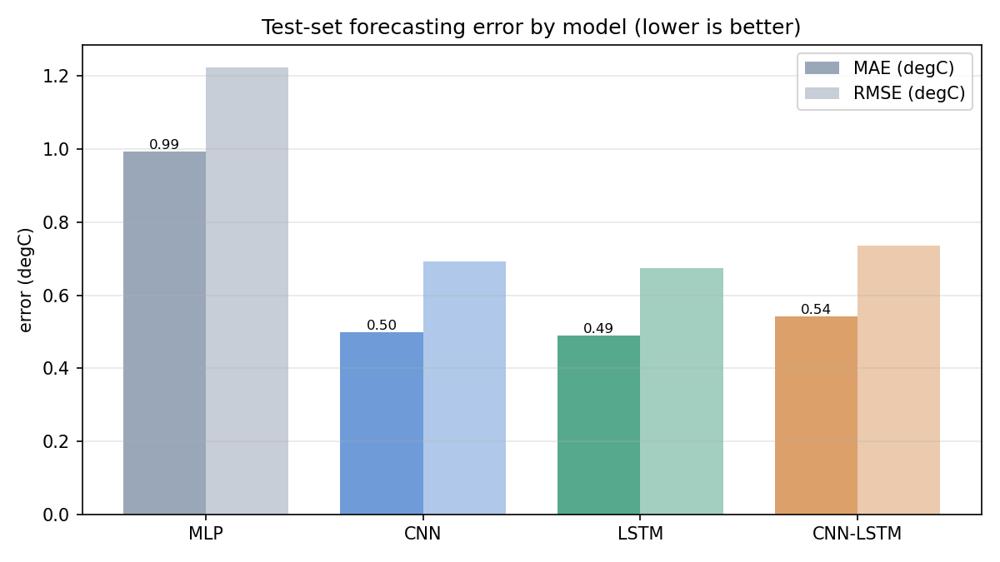
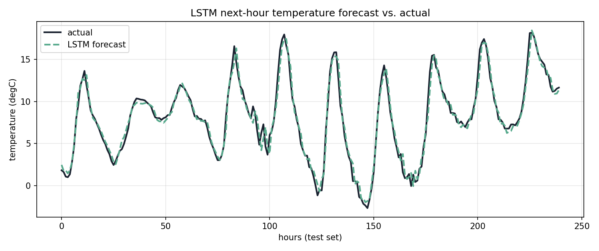
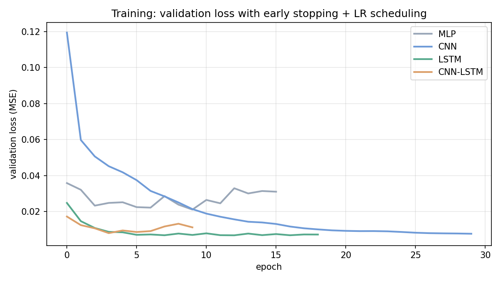

# LSTM Time-Series Forecasting

**Forecasting next-hour temperature from multivariate weather data with an LSTM — benchmarked against MLP, CNN, and CNN-LSTM baselines.**

A deep-learning pipeline for temporal data prediction on the **Jena Climate** dataset (8 years of weather readings, 2009–2016). Given the previous **48 hours** of observations, each model predicts the air temperature at the next hour. All four architectures share identical preprocessing and training so the comparison isolates how well each captures sequential dependencies.

## Results

On a held-out, chronologically-split test set, the **LSTM achieves the lowest error**, with the recurrent and convolutional models far ahead of the feedforward MLP baseline:

| Model | Test MAE (°C) | Test RMSE (°C) | Params |
| :--- | :---: | :---: | :---: |
| MLP | 0.99 | 1.22 | 94k |
| CNN | 0.50 | 0.69 | 21k |
| **LSTM** | **0.49** | **0.68** | 55k |
| CNN-LSTM | 0.54 | 0.74 | 40k |



The LSTM's next-hour forecast tracks the true temperature closely across the test period:



## How it works

**Advanced preprocessing**
- Resample 10-minute readings to hourly and clean sentinel (`-9999`) wind errors.
- Convert wind **speed + direction → a wind vector** (`Wx`, `Wy`) so direction is usable by the model.
- Encode time with **cyclical day/year sin–cos signals**.
- Chronological **70/15/15** train/val/test split; standardize using **train-set statistics only**; build 48-hour sliding windows.

**Models** (Keras): an MLP, a 1-D CNN, a stacked **LSTM**, and a **CNN→LSTM** hybrid — trained on the same windows toward the same target.

**Training strategy**
- Adam optimizer, MSE loss.
- **Early stopping** with best-weight restoration to prevent overfitting.
- **ReduceLROnPlateau learning-rate scheduling** to refine convergence.



*Validation loss per model: the MLP overfits and stops early, while the LSTM converges fastest to the lowest error.*

## Run it

```bash
pip install -r requirements.txt
python download_data.py     # fetches the Jena Climate CSV (auth-free)
python train.py             # trains all four models -> assets/ + results/
```

## Repo structure

```text
train.py          full pipeline: preprocessing, models, training, evaluation, figures
download_data.py  fetch the Jena Climate dataset
assets/           benchmark, training-curve, and forecast figures
results/          metrics.csv / metrics.json
requirements.txt  dependencies
```

## Tech stack

Python · TensorFlow / Keras · NumPy · Pandas · Matplotlib
